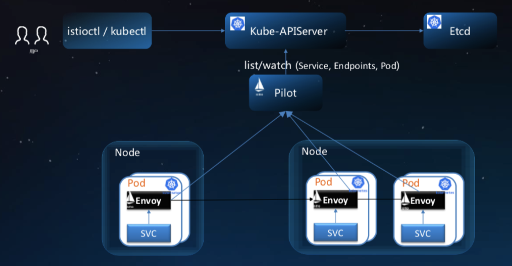

# istio-demo

Istio 是一个开源的Service Mesh实现，是新的微服务技术，它与我们熟悉的微服务框架Dubbo在实际使用上有什么不同呢？<br>
我们来初步体验一下istio的服务注册、发现、调用及路由功能。

----

## Service Mesh／Istio

Service Mesh（服务网格）号称下一代微服务技术，通过将网络通讯层基础设施下沉，实现抽离微服务中的通用功能，比如：服务注册发现、负载均衡、降级熔断、限流扩容、认证授权、日志监控等功能，将这些功能放到sidercar中，基于网路层轻量级代理的方式，将基础设施和业务服务解耦。

Istio是一个热门的Service Mesh开源实现，一般情况我们将它与k8s集群结合使用。

它具有以下两种功能组：

- 控制平面：是一系列管理配置和监测数据平面的Istio服务(istiod)
- 数据平面：由应用Pod中的Istio代理sidecar组成(基于Envoy)。这些代理会处理服务网格中微服务之间的网络连接，从控制平面接收微服务的路由和策略规则，并向控制平面报告连接被处理的结果。

## 服务的注册、发现和调用

Bookinfo是Istio官方提供的一个微服务风格的书店应用，我们把它作为实验对象，用于演示Istio的各种特性。

### Bookinfo介绍

Bookinfo项目涉及4个独立的微服务：<br>
（1）Productpage（产品页面，调用Details和Reviews服务，Python开发）<br>
（2）Details（详情服务，Ruby开发）<br>
（3）Reviews（评论服务，调用Ratings服务，Java开发，提供有3个版本）<br>
（4）Ratings（评分服务，NodeJs开发）<br>

传统部署方式：


### 安装部署

- Kubernetes v1.18.3
- Istio v1.6.4

以下安装步骤供参考：

```bash
#针对default命名空间，打开自动注入sidecar功能。自动注入是利用了k8s的Admission webhook实现的。
kubectl label namespace default istio-injection=enabled
#部署内容包括4个service，以及6个deployment（Reviews每个版本各有一个deployment）
kubectl apply -f samples/bookinfo/platform/kube/bookinfo.yaml
#尝试在集群内的ratings pod中调用productpage，确认应用运行正常
kubectl exec -it $(kubectl get pod -l app=ratings -o jsonpath='{.items[0].metadata.name}') -c ratings -- curl productpage:9080/productpage | grep -o "<title>.*</title>"
```

基于istio部署方式：


### 源码分析

#### 1、部署脚本

部署脚本即samples/bookinfo/platform/kube/bookinfo.yaml，可以看到里面定义的均为标准Kubernetes的Deployment和Service对象。为当前namespace开启sidecar自动注入后，我们创建的每个pod中均自动创建	istio-proxy容器。

#### 2、服务注册发现

在传统的微服务框架Dubbo中，采用的是“客户端嵌入式代理方式”，需要通过独立的服务注册中心（如：Zookeeper）配合，服务启动时自动注册到注册中心，客户端代理则发现服务并做负载均衡和调用。Istio采用的是“主机独立进程代理”，无需注册中心（还是需要k8s集群中etcd的支持），由独立代理（istio-proxy|Kube-proxy）实现服务发现和负载均衡.

Istio在k8s平台的服务发现和配置示意图：



各个服务的注册发现均基于k8s集群内的服务解析。以Ratings为例，服务实现samples/bookinfo/src/ratings/ratings.js中，通过samples/bookinfo/platform/kube/bookinfo-ratings.yaml发布到k8s集群。

```yaml
# Ratings service
apiVersion: v1
kind: Service
metadata:
  name: ratings
  labels:
    app: ratings
spec:
  ports:
  - port: 9080
    name: http
  selector:
    app: ratings
---
apiVersion: apps/v1
kind: Deployment
metadata:
  name: ratings-v1
  labels:
    app: ratings
    version: v1
spec:
  replicas: 1
  #...
```

```js
dispatcher.onGet(/^\/ratings\/[0-9]*/, function (req, res) {
  var productIdStr = req.url.split('/').pop()
  var productId = parseInt(productIdStr)
  //...
}
```

#### 3、服务间调用

Bookinfo的服务间通过HTTP通讯。以Java开发的微服务Reviews调用Python开发的Ratings为例，Reviews通过GET ratings(.default.svc.cluster.local):9080/ratings/{productId}访问Ratings，得到某个特定产品的评分。

在代码samples/bookinfo/src/reviews/reviews-application/src/main/java/application/rest/LibertyRestEndpoint.java中有调用服务Ratings的实现。同时我并未发现对环境变量SERVICES_DOMAIN和RATINGS_HOSTNAME的赋值，同一命名空间服务地址应为http://ratings:9080/ratings/{productId}

```java
 private final static String services_domain = System.getenv("SERVICES_DOMAIN") == null ? "" : ("." + System.getenv("SERVICES_DOMAIN"));
 private final static String ratings_hostname = System.getenv("RATINGS_HOSTNAME") == null ? "ratings" : System.getenv("RATINGS_HOSTNAME");
 private final static String ratings_service = "http://" + ratings_hostname + services_domain + ":9080/ratings";

 private JsonObject getRatings(String productId, HttpHeaders requestHeaders) {
      //...
      Client client = cb.build();
      WebTarget ratingsTarget = client.target(ratings_service + "/" + productId);
      Invocation.Builder builder = ratingsTarget.request(MediaType.APPLICATION_JSON);
      //...
 }
```

## 服务路由选择

浏览器访问 [http://www.hmxq.top:30124/](http://www.hmxq.top:30124/ " ")，
多刷新几次，可以看到绿、蓝、橙的不同版本页面。

```bash
wget https://github.com/istio/istio/releases/download/1.6.4/istio-1.6.4-linux-amd64.tar.gz
ar xvzf ./istio-1.6.4-linux-amd64.tar.gz
cd istio-1.6.4
export PATH=$PWD/bin:$PATH
istioctl manifest apply
kubectl get svc -n istio-system
kubectl get pods -n istio-system

kubectl create ns my-istio-demo
kubectl label namespace my-istio-demo istio-injection=enabled
#创建业务应用
kubectl create -f my-websites.yaml -n my-istio-demo
#创建istio的ingressgateway 和 VirtualService
kubectl create -f my-website-routing.yaml -n my-istio-demo
#获取端口30980
kubectl -n istio-system get service istio-ingressgateway -o jsonpath='{.spec.ports[?(@.name=="http2")].nodePort}'  
```

```yaml
apiVersion: networking.istio.io/v1alpha3
kind: Gateway
metadata:
  name: website-gateway
spec:
  selector:
    istio: ingressgateway
  servers:
  - port:
      number: 80
      name: http
      protocol: HTTP
    hosts:
    - "*"
---
apiVersion: networking.istio.io/v1alpha3
kind: VirtualService
metadata:
  name: website-virtual-service
spec:
  hosts:
  - "*"
  gateways:
  - website-gateway
  http:
  - route:
    - destination:
        host: website
        #subset: version-1
---
#...
```

